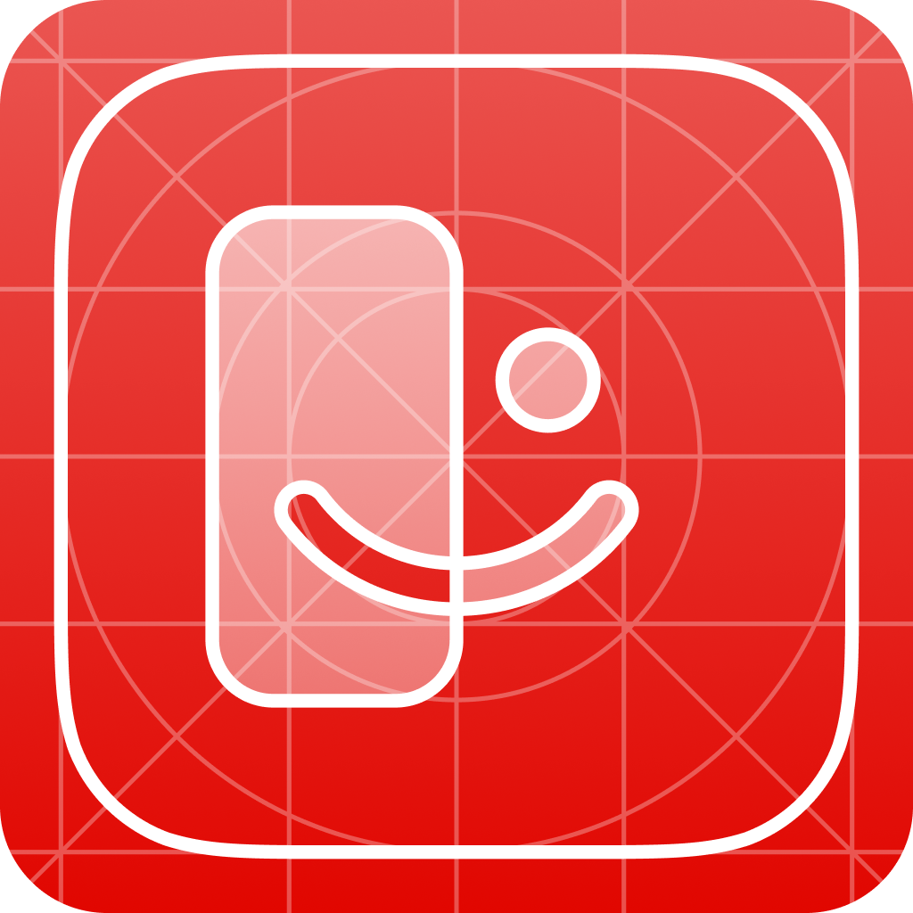
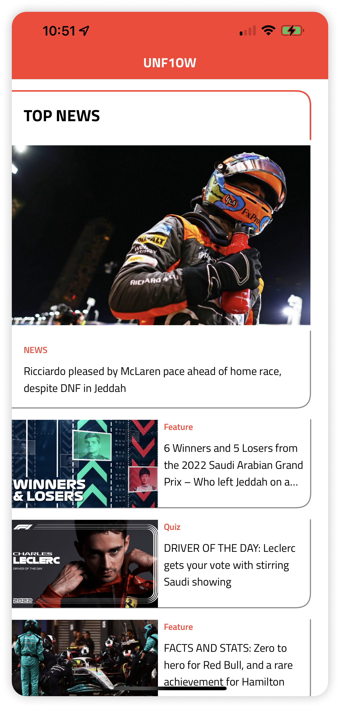
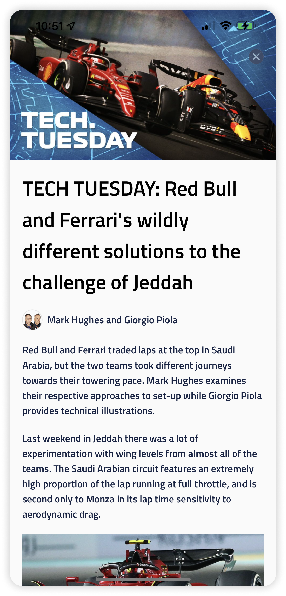
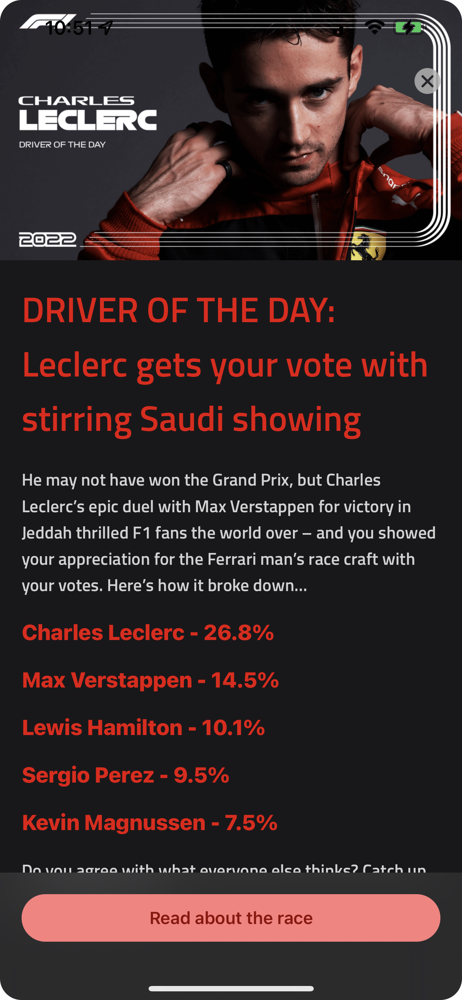

# **Unf1ow**

An example of using [Unflow](https://www.unflow.com) to build something entirely custom. Unflow can act as a CMS and handle all of the heavy lifting, you just tell it how to lay out your content.

## **Samples**

| Example | Screenshot |
| - | - |
| The formula one homepage built using our custom openers. All in Native SwiftUI, simply using Unflow as its data source. |  |
| An article built out using the Unflow dashboard, presented when selecting one of the cards on the homepage. |  |
| Another more advanced example using dark mode and a link out to a website.  |  |
